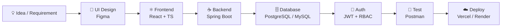

<!-- ===================== HEADER ===================== -->
<p align="center">
  
</p>

<p align="center">
  
</p>

<p align="center">
  <a href="https://personal-portfolio-002-zeta.vercel.app/"></a>
  <a href="https://github.com/anbarasu002"></a>
  <a href="https://www.linkedin.com/in/anbarasu-s-76557124a"></a>
  <a href="mailto:sanbarasu2003@gmail.com"></a>
  
</p>

<p align="center">
  
  
  
  
</p>

---

## 👨‍💻 About Me

Hi! I'm **Anbarasu S**, a **Java Full Stack Developer** and 2025 graduate who loves building modern, scalable and user-friendly web applications.

I work on both **frontend and backend**, mainly with **Java, Spring Boot, REST APIs, React and SQL**. I enjoy taking an idea and turning it into a complete product: responsive UI → secure APIs → database design → authentication → cloud deployment.

```java
public class Anbarasu {
    String role       = "Java Full Stack Developer";
    String education  = "B.E. - Velalar College of Engineering & Technology (2025)";
    String location   = "Erode, Tamil Nadu, India";
    String[] backend  = {"Java", "Spring Boot", "Spring Security", "JPA", "REST APIs"};
    String[] frontend = {"React", "TypeScript", "JavaScript", "Tailwind CSS"};
    String[] database = {"PostgreSQL", "MySQL"};
    String goal       = "Become a strong software engineer & solve real-world problems";
}
```

| | |
|---|---|
| 💻 **Role** | Java Full Stack Developer |
| 🎓 **Education** | B.E. — Velalar College of Engineering & Technology (83%) |
| 💡 **Interested in** | Spring Boot, React, REST APIs, Database Design, Cloud Deployment |
| 🔎 **Open to** | Java Full Stack Developer · Full Stack Developer · Software Engineer · Junior Developer |
| ⚡ **Fun fact** | I ship every project live — if it's not deployed, it's not finished! |

---

## 🛠️ Tech Stack

<p align="center">
  
</p>

<details open>
<summary><b>💻 Languages</b></summary>
<br>


</details>

<details open>
<summary><b>🎨 Frontend</b></summary>
<br>


</details>

<details open>
<summary><b>⚙️ Backend</b></summary>
<br>


</details>

<details open>
<summary><b>🗄️ Database</b></summary>
<br>


</details>

<details open>
<summary><b>🔧 Tools, DevOps & Cloud</b></summary>
<br>


</details>

---

## 🚀 Featured Projects

### 📚 Book World — Online Book Management & Shopping Platform
> **Full Stack Java Web Application**

An online book platform with a React frontend and Spring Boot backend for browsing, searching and managing books.


**✨ Features**
- 📚 Browse and explore books
- 🔍 Search functionality
- 👤 User functionality
- 📱 Responsive React interface
- 🔗 REST API integration & ☁️ backend deployment

<a href="https://full-stack-online-book-store-web-ap.vercel.app/"></a>

---

### 👨‍💼 OrbitHR — Employee Management System
> **Full Stack Employee Management Application**

Manage employee information through a modern React frontend and a REST-based Spring Boot backend.


**✨ Features**
- ➕ Add, ✏️ edit and 🗑️ delete employee records
- 🔗 Full frontend–backend integration
- ☁️ Cloud deployment

<a href="https://employee-management-system-eight-gules.vercel.app/"></a>

---

### 🛒 E-Commerce Website
> **Responsive E-Commerce Application**


**✨ Features:** 🛍️ Product browsing · 🔍 Search · 🛒 Shopping cart · 📱 Responsive UI · 🔗 API integration

<a href="https://e-commerce-frontend-alpha-lake.vercel.app/"></a>

---

## 🧭 How I Build Applications



---

## 📊 GitHub Statistics

<p align="center">
  
</p>

<p align="center">
  
</p>
---

## 💼 Experience

### 🟢 Full Stack Java Developer Apprentice — *BDreamz Global Solutions Pvt. Ltd.* (2025)
- Built features using **Java, Spring Boot, REST APIs and MySQL**
- Worked with **Git, JIRA and Agile / Scrum** in a team environment

---

## 🎓 Education

| Degree | Institution | Year | Score |
|---|---|---|---|
| **B.E.** | Velalar College of Engineering & Technology | 2021 – 2025 | **83%** |

---

## 📜 Training & Certifications

| 🏅 Program | 🏢 Provider | 📅 Year |
|---|---|---|
| Java Full Stack Development | Besant Technologies, Bangalore | 2025 |
| Full Stack Java Developer Apprenticeship | BDreamz Global Solutions | 2025 |
| GenAI Powered Data Analytics | TATA (Forage) | 2026 |
| Front-End Software Engineering | Skyscanner (Forage) | — |
| Software Engineering for Startups | Blackbird (Forage) | — |
| Technology Virtual Experience | Deloitte (Forage) | — |

---

## 🏆 What I Build

| | | |
|---|---|---|
| 🌐 Full Stack Web Apps | ☕ Spring Boot Backends | ⚛️ React Frontends |
| 🔗 RESTful APIs | 🗄️ Database-driven Apps | 🔐 Auth & Authorization |
| ☁️ Cloud-deployed Apps | 📊 Enterprise Systems | 🎨 Responsive UIs |

---

## 🎯 2026 Goals

- [x] Build and deploy multiple full-stack projects
- [x] Complete a Java Full Stack apprenticeship
- [ ] Get a full-time Java Full Stack Developer role
- [ ] Master Spring Security & microservices basics
- [ ] Solve 200+ DSA problems
- [ ] Contribute to open-source projects

---

## 💼 Open To

<p align="center">
  
  
  
  
  
</p>

I'm looking for opportunities where I can contribute to real-world software, learn from experienced developers and grow as a professional software engineer.

---

## 🤝 Let's Connect

<p align="center">
  <a href="https://personal-portfolio-002-zeta.vercel.app/"></a>
  <a href="https://www.linkedin.com/in/anbarasu-s-76557124a"></a>
  <a href="mailto:sanbarasu2003@gmail.com"></a>
  <a href="https://github.com/anbarasu002"></a>
</p>

<p align="center">
  <b>☕ Java • 🌱 Spring Boot • ⚛️ React • 🔗 REST APIs • 🐘 PostgreSQL</b>
</p>

<p align="center">
  
</p>

<p align="center">
  ⭐ If you find my projects useful, feel free to star my repositories!
</p>

<p align="center">
  
</p>
